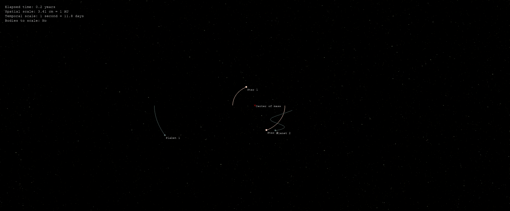

# Orbit sim

Application for simulating gravity between bodies with [Newton's law of universal gravitation](https://en.wikipedia.org/wiki/Newton%27s_law_of_universal_gravitation).

## Installation

1. Clone the repository.
2. [Create a virtual environment and activate it](https://docs.python.org/3/library/venv.html).
3. Install the requirements: `pip install -r requirements.txt`
4. Start the sim: `python orbit.py`

## Constellations

The constellations that Orbit sim can simulate are defined in Python files. See the `constellations` folder for examples.

## Controls

### Keyboard

* Press `t` key: show/hide body tail.
* Press `s` key: set/unset bodies to scale.
* Press `S` key: save a screenshot under the name "screenshot.png".
* Press `g` key: save an animated GIF under the name "animated.gif".
* Press `UP` key: increase time scale.
* Press `DOWN` key: decrease time scale.
* Press `r` key: reset camera rotation and set perspective to center of mass.

### Mouse

* Drag left mouse button: pan the camera.
* Drag right mouse button: rotate the camera.
* Press left mouse button: change perspective to the nearest body.
* Mouse wheel: zoom.

## Profiling

Since a lot of computations have to be done to calculate the orbits of the celestial bodies, performance is important. To profile the source code, run the following commands:

1. Run the program while profiling: `python -m cProfile -o profile.out orbit.py constellations/solar_system.py`
1. Analyze the stats: `python -m pstats profile.out`

Alternatively, create a graph of the profile results:

1. Install the development requirements: `pip install -r requirements-dev.txt`
1. Install [GraphViz](https://graphviz.org)
1. Convert the profile info into a dot file: `gprof2dot -f pstats profile.out > profile.dot`
1. Convert the dot file into a png: `dot -Tpng profile.dot > profile.png`

## References

1. [Planet images](https://deep-fold.itch.io/pixel-planet-generator)
2. [Solar system data](https://nssdc.gsfc.nasa.gov/planetary/factsheet/)
3. [Background image](https://pixabay.com/illustrations/stars-night-dark-sky-space-3750824/)
